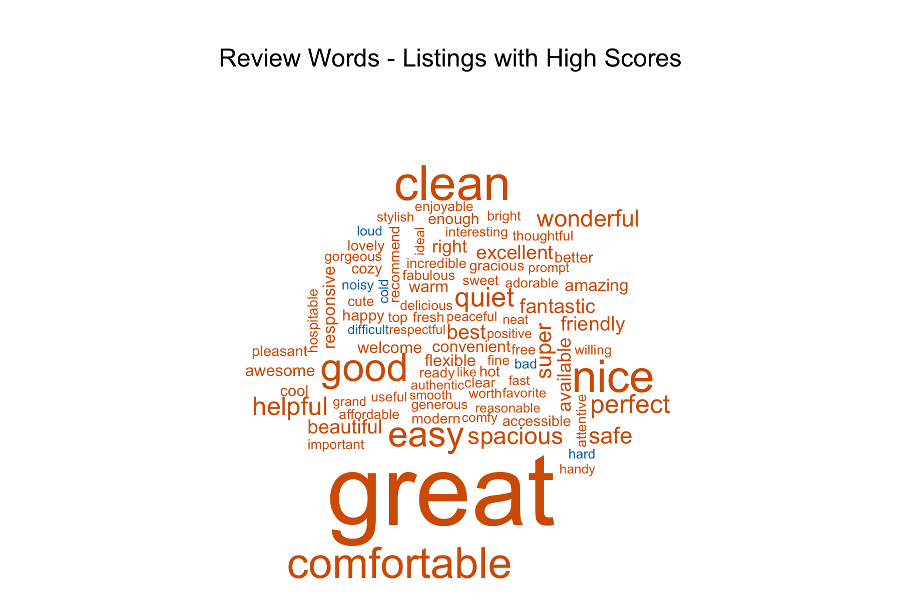
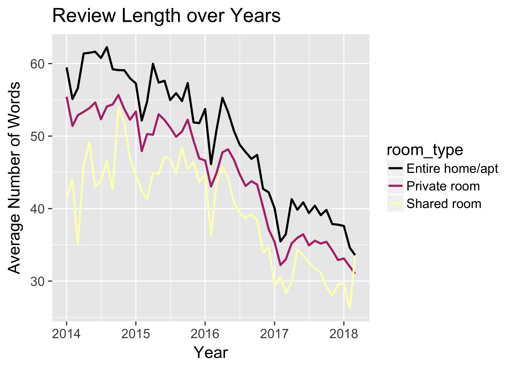

```{r setup, include=FALSE}
knitr::opts_chunk$set(echo = TRUE)
```

## Executive Summary 

The goal of this EDAV project is to learn about how Airbnb is being utilized in New York City. We approached this topic by looking at geographic distribution of the listings (reflected by our interctive component), price distribution, room type distribution, some general policies, and review texts. Below we highlight some of our most revealng findings about Airbnb in NYC.

### Overview

```{r}
knitr::include_graphics('images/overall_summary.png')
```

As of March 4th 2018, there are 48825 Airbnb listings available in New York City. Among them, Manhattan and Brooklyn have the highest number of listings and highest number of reviews, indicating high availability and popularity. Manhattan has highest average price per night at \$183, followed by Staten Island at \$127.

### Price Distribution

```{r}

```

The vast majority of Airbnb prices lie between \$0 to \$400 per night. The most common prices happen somewhere between \$50 to \$150 depending on the borough. Among the two most popular boroughs Manhattan and Brooklyn, Brooklyn tends to have more cheaper Airbnb places with prices listed most frequently (over 50%) around \$50 to \$100. Overall price distribution in Brooklyn is highly concentrated on the cheaper side-- over 90% of listings are below \$200 per night.

Manhattan on the other hand is slightly more expensive and prices are more evenly distributed. The most frequent prices per night are still in the neighbourhood of \$50 to \$100, but the total count in this interval is significantly lower than that in Brooklyn, meaning that there is a higher percentage of listings in Manhattan that have higher prices such as in the \$100 - \$200 range or even over \$200. In fact, one can find more listings with prices overall \$200 in Manhattan than in any other boroughs. 

### Room Type Distribution

```{r out.width = "450px"}

```

There are three types of rooms avaiable across Airbnb listings -- private room, shared room, and entire home / apartment. Overall the shares of entire home versus single private room are relatively even. Approximately half of all the listings are private rooms and half are entire homes. The percentages fluctuate a little bit once we break the listings into boroughs. Manhattan offers a higher chance for renting an entire apartment, while the rest of the boroughs have higher shares of private rooms. Shared rooms are very rare across all boroughs.

### Most Popular Neighbourhoods

```{r}

```

While the statistic of how many times a listing is booked is not available in our data, we do have access to see the number of reviews each listing has, and we take this as an indicator of a listing's popularity. When we aggregate number of reviews by neighbourhoods and rank them, the top five most reviewed / most popular neighbourhoods are : Bedford-Stuyvesant (Brooklyn), Williamsburg (Brooklyn), Harlem (Manhattan), Hell's Kitchen (Manhattan), and East Village (Manhattan). The top two neighbourhoods are both in Brooklyn possibly due a combination of culture popularity and economical prices, as we discovered earlier, Brooklyn tend to offer more friendly prices than Manhattan. 

### Most Common Adjective Words in Reviews

```{r}

```

Words used in reviews to describe experiences can vary in different domains of business. In this plot, brown color indicates words with positive sentimen while blue words represents negative words. For references, the majority of words in this wordcloud is brown. The size of the words is proportional to its frequency. This word cloud is made of the top 200 common words from the reiviews of the listings with high rating. Here, we can notice two major groups of adjective words used in visitors' reviews. One group of words to express their general feelings while the other group is to describe the conditions of places. To express feelings, people like to use general positive words, such as "great", "good", "nice". While describing a place, one would use "spacious", "clean", "safe". 

Since those words are collected from listings with high ratings, we can notice that the majority are positive words (in brown). Only a small portion of negative words (in blue) are in this collection. Within this collection, a set of words to express high level of satisfaction can be observed (e.g. "super", "fantastic", "wonderful").    

```{r}

```

In contrast to the adjective words collected from reviews of listings with higher ratings, the first thing catches our eyes in this wordcloud plot from low-rating listings is that blue words become more obvious. Although we can see some positive words similar to the review words collected from high-rating listings, the proportion of negative words increases. Among the negative words, "bad" is the most frequent, following by "dirty", "loud", "uncomfortable". One interesting observation from both wordclouds is that, irrespective of high or low ratings, general expression words ("great", "bad") are used more frequently in reviews that words related to the description of the listings. 

### Variation of Reviews Length for High and Low Ratings Listings
```{r out.width = "500px"}
knitr::include_graphics("images/ReviewsRatings.png")
```

This bar chart shows variation of the length of reviews in the combination of room types and the reviews rating category of listings and provides insights on users behaviour. The x-axis is the rating category while the axis is the average number of words. The color represents three room types: Entire home, Private room and Shared room. When it comes to write about experiences, people intend to write longer reviews as they talk about good feelings. By comparing category A and C, we can see that the number of words increases as the good feelngs goes up. While, in terms of room types, there is no difference of the three room typesin Shared room, Entire home/apartment have longer reviews followed by the room type Private room.

### Change of the Length of Reviews over years
```{r out.width = "500px"}

```

In this line chart, we present the change of the length of reviews from 2014 to 2018. The x-axis represents year while the y-axis shows the average number of words in reviews in each room type. Line colors are used for three different kinds of room types - Entire home/apartment, Private room and Shared room. As you can see in the plot, the trend clearly indeicates that the review length decreases gradually from around 53 words in 2014 to 33 words n 2018 on the average of the three room types. It may be due to change of users behvaiour generally online or specifically to airbnb website.  