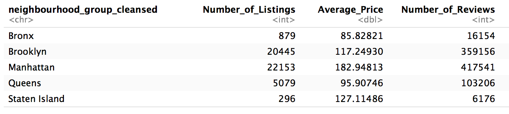

```{r setup, include=FALSE}
knitr::opts_chunk$set(echo = TRUE)
```

## Executive Summary 

The goal of this EDAV project is to learn about how Airbnb is being utilized in New York City. We approached this topic by looking at geographic distribution of the listings (reflected by our interctive component), price distribution, room type distribution, some general policies, and review texts. Below we highlight some of our most revealng findings about Airbnb in NYC.

### Overview

```{r}

```

As of March 4th 2018, there are 48825 Airbnb listings available in New York City. Among them, Manhattan and Brooklyn have the highest number of listings and highest number of reviews, indicating high availability and popularity. Manhattan has highest average price per night at \$183, followed by Staten Island at \$127.

### Price Distribution

```{r}
knitr::include_graphics('images/price_by_borough.png')
```

The vast majority of Airbnb prices lie between \$0 to \$400 per night. The most common prices happen somewhere between \$50 to \$150 depending on the borough. Among the two most popular boroughs Manhattan and Brooklyn, Brooklyn tends to have more cheaper Airbnb places with prices listed most frequently (over 50%) around \$50 to \$100. Overall price distribution in Brooklyn is highly concentrated on the cheaper side-- over 90% of listings are below \$200 per night.

Manhattan on the other hand is slightly more expensive and prices are more evenly distributed. The most frequent prices per night are still in the neighbourhood of \$50 to \$100, but the total count in this interval is significantly lower than that in Brooklyn, meaning that there is a higher percentage of listings in Manhattan that have higher prices such as in the \$100 - \$200 range or even over \$200. In fact, one can find more listings with prices overall \$200 in Manhattan than in any other boroughs. 

### Room Type Distribution

```{r}
knitr::include_graphics('images/Room_Type.png')
```

There are three types of rooms avaiable across Airbnb listings -- private room, shared room, and entire home / apartment. Overall the shares of entire home versus single private room are relatively even. Approximately half of all the listings are private rooms and half are entire homes. The percentages fluctuate a little bit once we break the listings into boroughs. Manhattan offers a higher chance for renting an entire apartment, while the rest of the boroughs have higher shares of private rooms. Shared rooms are very rare across all boroughs.

### Most Popular Neighbourhoods

```{r}
knitr::include_graphics('images/most_reviewed_50.png')
```

While the statistic of how many times a listing is booked is not available in our data, we do have access to see the number of reviews each listing has, and we take this as an indicator of a listing's popularity. When we aggregate number of reviews by neighbourhoods and rank them, the top five most reviewed / most popular neighbourhoods are : Bedford-Stuyvesant (Brooklyn), Williamsburg (Brooklyn), Harlem (Manhattan), Hell's Kitchen (Manhattan), and East Village (Manhattan). The top two neighbourhoods are both in Brooklyn possibly due a combination of culture popularity and economical prices, as we discovered earlier, Brooklyn tend to offer more friendly prices than Manhattan. 